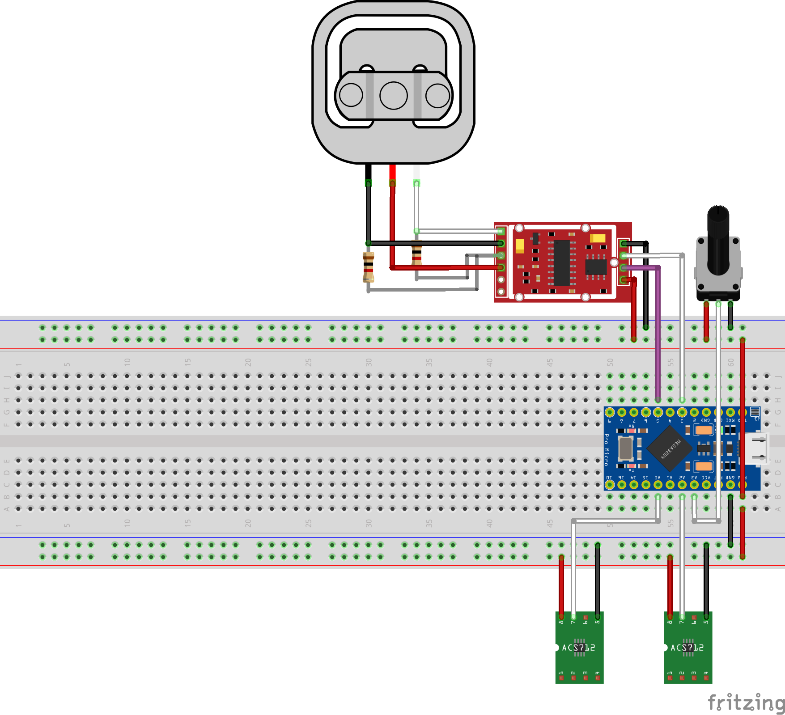

# Wiring and assembly

Start with the board disconnected from USB and the pedals disconnected from
all other controllers. These instructions cover the default three-pedal build.
They are a wiring guide, not confirmation that every Fanatec revision uses the
same sensors, colors or supply voltage.

## Pin table

| Signal | Controller / connection |
| --- | --- |
| Throttle analog output | A0 |
| Clutch analog output | A2 |
| HX711 DT / DOUT | Digital pin 3 |
| HX711 SCK / CLK | Digital pin 5 |
| HX711 ground | Controller GND |
| HX711 supply | Per module specification; the intended controller is 5 V |
| Hall sensor grounds | Controller GND |
| Hall sensor supplies | Their rated supply, verified before connecting |
| Optional sensitivity pot wiper | A3; ignored unless `BRAKE_POT_ENABLED` is enabled |
| Optional second throttle / clutch output | A5 / A8; source configuration required |

Use analog pin names, not the board's physical pin position. An A5 or A8
connection is unnecessary for the default single-output sensors. Dual-input
mode averages two compatible outputs; it does not double ADC resolution.
Only enable it for sensors whose two outputs should be averaged.

All connected modules need a common signal ground. Sensor output voltage must
stay within the controller ADC's input range. Original sensors supplied with
3.3 V by their stock board must not be assumed safe at 5 V. Identify the part
or establish its rating before choosing the supply. Never power the same
sensor from both the original controller and this board.

## Load-cell connection

For a **four-wire full bridge**, use the cell manufacturer's pinout:
excitation +/− to HX711 E+/E−, signal +/− to A+/A−. Wire colors vary. This
firmware uses channel A at gain 128. Reversed signal polarity is handled by
calibration, provided the electrical input remains within the ADC's range.

A **three-wire half bridge** needs bridge completion or a compatible second
half bridge. The original example uses two 1 kΩ resistors to complete the
bridge. Do not assume those resistors or that diagram apply to a four-wire
cell, and do not identify excitation/signal solely by color. Confirm the cell
wiring and resistance arrangement with its documentation and a meter first.

The drawing is the historical Pro Micro/three-wire-load-cell example. It shows
particular sensor modules and an optional brake pot; it is not a verified
pinout for every ClubSport V1/V2 sensor or HX711 breakout. The table above and
the labels/datasheets of your actual parts take precedence. The editable
original is [Circuit.fzz](../Circuit.fzz) (in the repository/source archive).

## Prototype before soldering

1. Identify board, sensor and cell pins. Label wires before removing the old
   controller. Photograph your own wiring for future reference.
2. Mount Hall sensors so the magnet moves smoothly through a useful part of
   their range. The output should change gradually, not switch on/off. Adjust
   position without allowing bare contacts to touch the metal pedal frame.
3. Connect signal grounds, then the intended supplies and signals. Keep bridge
   signal wires short and away from noisy power wiring; secure all connectors.
4. With power off, inspect polarity, shorts and continuity. Do not rely on a
   breadboard rail continuing through a center split.
5. Power from USB, install the firmware, and use `monitor` to verify that moving
   each pedal changes its own raw value. Ensure nothing heats unexpectedly.
6. Calibrate and confirm stable endpoints before making permanent joints.

## Permanent assembly

Cut and strip only enough insulation for the joint. Tin the wire and pad, make
a clean joint, and insulate exposed connections with heat shrink. Avoid long
bare sections and solder bridges. Add strain relief so pedal movement and USB
cable pulls cannot load a solder joint. Mount the controller/amplifier on
insulating standoffs inside a suitable enclosure, away from the moving pedal
mechanism. Inspect continuity again with USB unplugged, then repeat calibration
and the release/full-travel checks.

## HX711 at 80 samples/second

The HX711 **RATE** pin selects 10 SPS when low and 80 SPS when high. Modules
expose this as a switch, solder jumper, pad, or not at all. The meaning of an
open/closed jumper differs between designs: inspect the module schematic and
follow its manufacturer's instructions. Power off before changing a jumper.
Do not bridge unknown pads or connect a pin that is already grounded to supply.

The firmware cannot select RATE through DT/SCK. After a supported change,
recalibrate and observe `Valid brake conversions` in the monitor; it should
be near 80 rather than 10 Hz under a responsive host. See the
[HX711 datasheet](https://image.dfrobot.com/image/data/SEN0160/hx711_english.pdf)
and [performance notes](performance.md).
